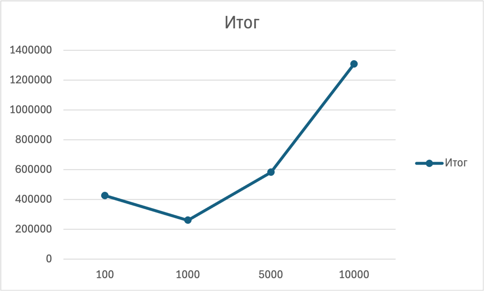
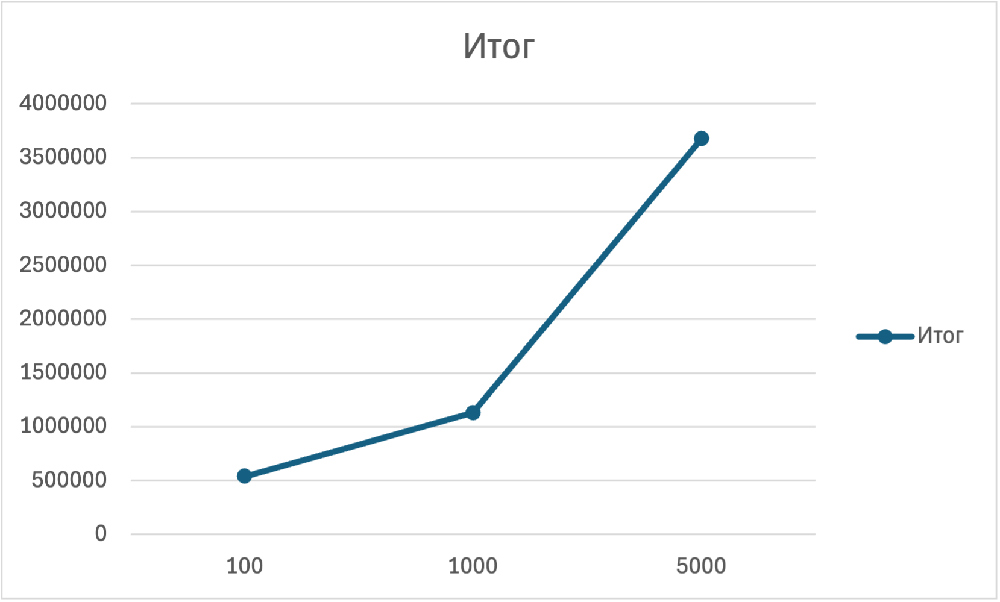
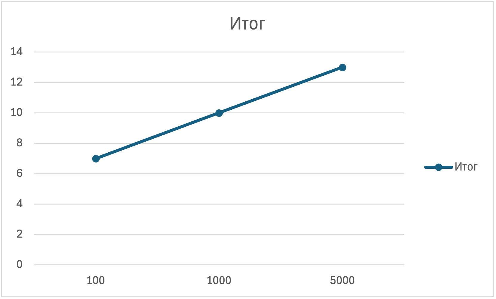

# Assignment 1 Report — Design and Analysis of Algorithms 
## Goals
- Implement classic D&C algorithms with safe recursion.
- Analyze recurrences with Master Theorem and Akra–Bazzi intuition.
- Collect metrics (time, recursion depth, comparisons, allocations).
- Report results with clean Git workflow.

## Implemented Algorithms
- MergeSort (linear merge, cutoff, reusable buffer)
- QuickSort (randomized pivot, smaller-first recursion)
- Deterministic Select (Median-of-Medians)
- Closest Pair of Points (2D, O(n log n))

## Architecture Notes
In all algorithms, recursion is limited and no extra memory is created.
- MergeSort uses a single buffer and a cut-off for small arrays.
- In QuickSort, recursion only goes to a smaller part, and the pivot is chosen randomly. Deterministic Select is implemented in an iterative form (via while), so the recursive stack depth does not accumulate — in fact, it is 0.
- In Deterministic Select, after splitting, only the desired side is called.
- In the Closest Pair, sorting by x is done once, then recursive division and band checking are used without additional allocations.

## Recurrence analysis 
- **MergeSort:** MergeSort divides the array into two equal parts and performs a merge of linear complexity.\
The recurrence relation has the form:
 T(n) = 2T(n/2) + Θ(n).\
According to the Master Theorem (Case 2), this gives the final asymptotics:\
  T(n) = Θ(n log n)\
  The implementation uses optimizations: linear merge, reused buffer, and cutoff for small n, which reduces the constant and depth of recursion.
- **QuickSort**:For QuickSort with randomized reference element selection, the recurrence depends on the partitioning.\
On average, the following is performed:
  T(n) = T(k) + T(n − k − 1) + Θ(n),
  where k is equally likely distributed. \
On average, it turns out: T(n) = Θ(n log n).\
  Optimization by recursing only into a smaller part and iterating into a larger one provides a limited stack depth (approximately O(log n)).
- **Deterministic Select**: Deterministic Select uses grouping of 5 elements and selecting the median of the medians as the pivot. \
The recurrence is estimated as:
  T(n) = T(n/5) + T(7n/10) + Θ(n).\
  By the Akra–Bazzi theorem, we obtain the final asymptotics:
  T(n) = Θ(n).

  Since recursion goes only to the right part, the depth of calls decreases, and large subtasks do not accumulate.
- **Closest Pair of Points:** The algorithm first sorts the points by x, then divides them into two halves. The recurrence is described as:
  T(n) = 2T(n/2) + Θ(n).
  According to the Master Theorem (Case 2), the final complexity is:
  T(n) = Θ(n log n).
  The strip candidates are checked in the y-order and are limited to about 7-8 comparisons, which preserves the linear addition term.

## Plots
### Time vs n:
-**MergeSort**time%20vs%20n.png)
-**QuickSort**
-**Select**
-**Closest**

### Depth vs n:
-**MergeSort**recursion%20depth%20vs%20n.png)
-**QuickSort**
-**Closest**

### Constant-factor effects
Although all algorithms show expected asymptotic growth, the actual time depends on hidden costs: recursion depth, sorting within steps (in the Closest Pair and Select), additional work with arrays, cache memory, JVM warm-up and garbage collector. Because of this, there are small jumps and differences in scale, even with the same Big-O.

## Summary
For MergeSort and QuickSort, the time growth proceeds smoothly at different input sizes, as expected for (n\log n). For Deterministic Select, the time increases dramatically at an input of about 5000, which shows that practical overhead interferes with linear behavior. The Closest Pair algorithm also noticeably accelerates growth at maximum input.

In terms of recursion depth, MergeSort and QuickSort increase gradually. The Select depth is not fixed (in the current implementation it is zero). The growth of the Closest Pair is uniform, for example, from 8 to 10, then to 13. In general, the behavior corresponds to the theory, but the influence of the code structure and the scale of the input is visible.